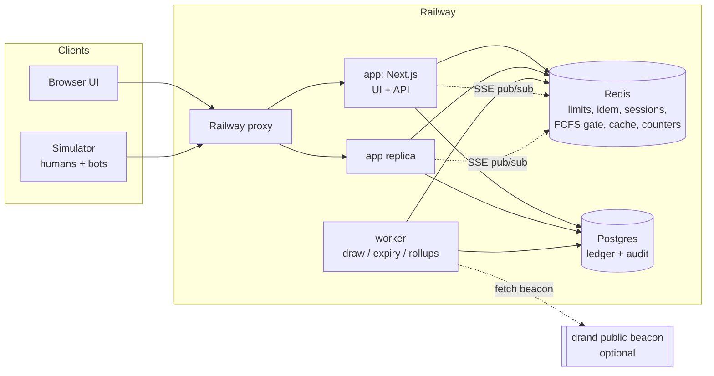
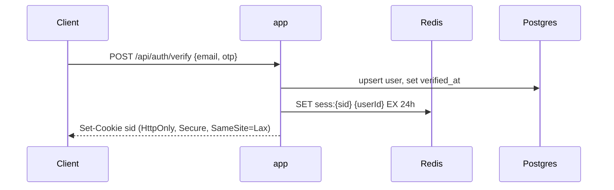
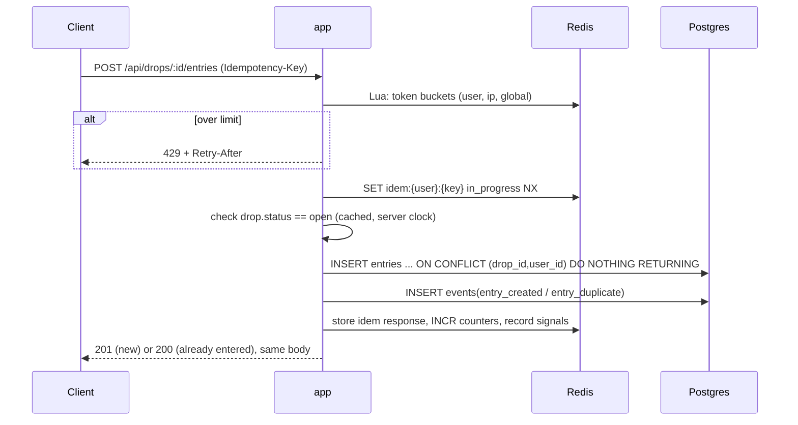
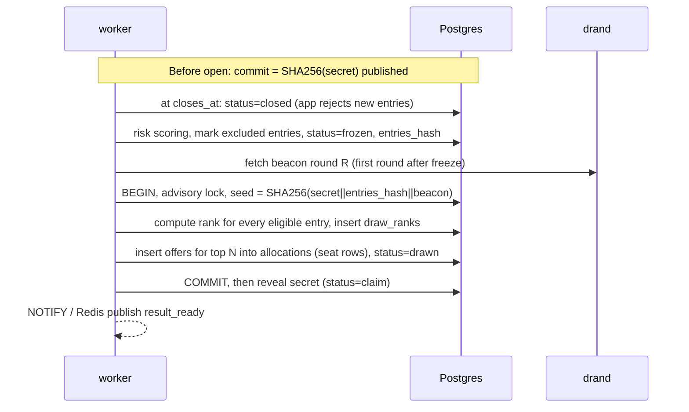
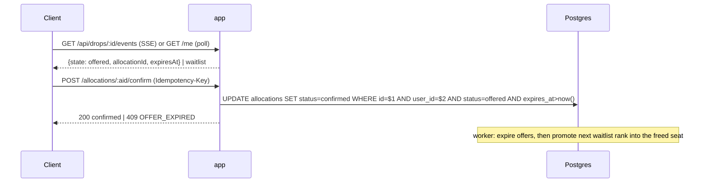

# Architecture

> **Deadline build:** BUILD_PLAN.md "Lean MVP" overrides this doc where they differ (single Next.js service + Postgres, no Redis, signed-cookie sessions, poll instead of SSE, auto-confirm, no drand). This doc describes the target design.

## Stack verdict
| Choice | Verdict | Reasoning |
|---|---|---|
| Next.js + TypeScript (UI + API route handlers) | **Keep**, but run as a long-lived Node server (`next start`) on Railway, not serverless | Route handlers are thin, and the bottleneck is Redis/Postgres round trips, not the framework. A long-lived process keeps PG/Redis connection pools and supports SSE. Serverless (for example Vercel) would break pooling and long-lived SSE. |
| Separate `worker` Node process (same repo, different start command) | **Add** | The draw, claim expiry, waitlist promotion, and metric rollups must not depend on an HTTP request staying alive, and must run exactly once. One worker with a PG advisory lock is simpler than coordinating this across app replicas. |
| Redis | **Keep** for rate limits, idempotency cache, sessions, the FCFS gate, hot status cache, and counters | **Not the source of truth.** Losing Redis must never lose an entry or allocation. |
| Postgres | **Keep** as the ledger for users, entries, seats, allocations, draw audit, and events | Unique constraints and row locks give correctness guarantees that Redis alone cannot (durability plus constraints). |
| k6 | **Secondary.** Use only for a raw throughput or flood test | Scenarios need labelled actors (human/bot/operator), multi-account behaviour, and outcome collection joined with server data. A Node simulator (`undici`, keep-alive) is simpler for this. |
| Node simulator | **Primary** load and bot tool | Runs from a Railway service in the same region (the private network avoids laptop and Wi-Fi limits), and locally for development. |
| Railway | **Keep**, with conditions | Plan limits (replicas, CPU, PG connections, egress) are unknown; see OPEN_QUESTIONS. The Railway proxy sets `X-Forwarded-For`, so IP rotation can only be simulated with a sim-only trusted header. |

Main stack risk: the entry write path on Postgres during a burst. Plan: write entries directly to PG (`INSERT ... ON CONFLICT DO NOTHING`) behind the Redis rate-limit gate. If M12 shows PG saturates, switch to a Redis Stream buffer with a worker flushing to PG and a drain barrier before the draw. This is designed but not built by default.

## System diagram

## Components
| Component | Responsibility |
|---|---|
| `app` | Auth/session, drop status, entry submission, FCFS purchase, claim confirm, result status, SSE, audit endpoint, admin API, dashboard UI. Stateless; any replica can serve any request. |
| `worker` | State transitions on schedule (open, close, freeze), commit-reveal, draw, claim expiry, waitlist promotion, risk scoring at freeze, metrics rollup. Holds `pg_advisory_lock(drop_id)` for each critical job. |
| `simulator` | Generates actors, drives scenarios, records client-side latency and outcomes, writes a run report. |
| `verify` | Standalone script. Takes the audit JSON and recomputes the seed and ranking. Has no DB access. |
| Redis | Ephemeral or rebuildable state only. |
| Postgres | Durable truth. Every invariant is enforced here by constraints. |

## Where state lives
| State | Location | Source of truth | If lost |
|---|---|---|---|
| Session | Redis `sess:*` (cookie holds an opaque id) | Redis | User signs in again. Their entry is unaffected (stored in PG). |
| Entry | PG `entries` | PG | n/a |
| Allocation / seat | PG `allocations`, `seats` | PG | n/a |
| Draw inputs and outputs | PG `drops`, `draw_ranks` | PG | n/a |
| Rate limit buckets | Redis | Redis | Limits reset. Brief over-admission is acceptable. |
| Idempotency responses | Redis (24h) | Redis, with PG unique constraints as backstop | A retry re-executes and hits the unique constraint, so the result is the same. |
| FCFS remaining counter | Redis | PG seats (Redis is a gate) | Rebuilt from PG on start |
| Live counters / metrics | Redis, rolled up into PG `metric_snapshots` | PG events | Rebuilt from `events` |
| Sim ground-truth labels | PG `sim_labels` | PG | **Never read by defense code** |

## Request flows

### Join (sign in)

### Entry (lottery mode)

### Draw (worker)

### Result and claim

### FCFS mode (comparison baseline)
`POST /api/drops/:id/purchase` runs a Redis Lua script that atomically checks the user is not in the buyers set, checks remaining > 0, decrements, and adds the user to buyers. On success, the app claims a free seat row in PG (`FOR UPDATE SKIP LOCKED`) and inserts the allocation. If the PG insert fails, the app compensates (`INCR` back). Unsafe mode skips Lua and locking and does a read-check-write in PG, so it oversells under concurrency on purpose.

## Why these choices
- **Lottery over queue.** A virtual queue still orders people by arrival time, so bots win by arriving first. A lottery has no ordering to win.
- **Seats as rows.** Overselling becomes structurally impossible: an allocation must reference one of the N seat rows, and a partial unique index allows only one active allocation per seat.
- **Single-transaction draw.** A draw is either fully committed or not at all. Re-running it is deterministic, so crash recovery means "run again".
- **PG as truth, Redis as accelerator.** Redis loss degrades protection briefly but never breaks integrity.
- **Separate worker.** Time-based transitions must happen even with zero traffic, and exactly once.
