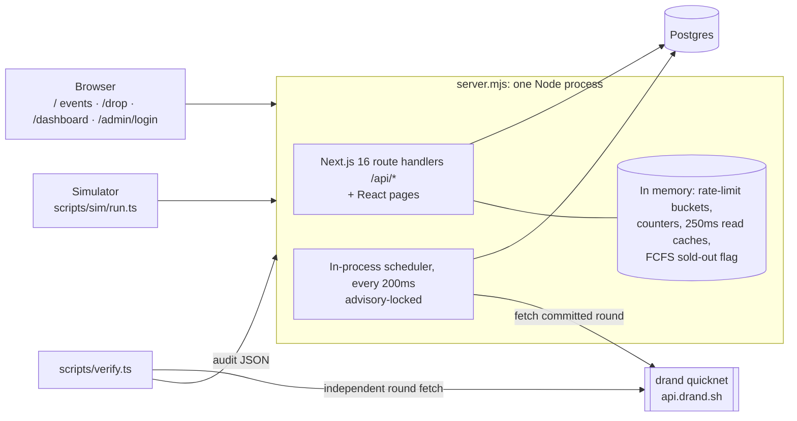

# Architecture (as built)

## System diagram

## Components
| Component | Where | Responsibility |
|---|---|---|
| `server.mjs` | repo root | Production entrypoint (`npm start`). Wraps Next.js to stamp the TCP peer address into `X-FD-Socket-IP`. |
| Route handlers | `src/app/api/**` | Auth (demo login), drops, entries, purchase, status (`/me`), audit, admin, sim-only endpoints. |
| Scheduler | `src/lib/scheduler.ts`, started from `src/instrumentation.ts` | Opens and closes windows, freezes (clustering and entry hash), draws. Every step re-checks status under `pg_try_advisory_xact_lock`, so duplicate ticks or instances are harmless. |
| Lottery | `src/lib/lottery.ts` (`enter`, `freeze`, `draw`, `audit`, `myState`) | Entry, freeze, draw, audit. |
| Draw math | `src/lib/draw-core.ts` | Pure functions shared with the verifier. |
| Beacon | `src/lib/beacon.ts` | drand quicknet round math, BLS verification, fetch with test hook. |
| FCFS | `src/lib/fcfs.ts` | Naive-but-correct `purchase` and deliberately broken `purchaseUnsafe`. |
| Integrity | `src/lib/integrity.ts` | Independent invariant checker. |
| Abuse | `src/lib/ratelimit.ts`, `src/lib/risk.ts`, `shedIfBusy` in `src/lib/http.ts` | Token buckets, draw-time clustering, load shedding. |
| Reporting | `src/lib/report.ts` | The only reader of `sim_labels` (ground truth). |
| Dashboard | `src/app/dashboard` | Comparison tables, across-seeds view, arrival-decile chart, live drops, demo controls. Cookie-gated via `/admin/login`. |
| Simulator | `scripts/sim` | Labelled human and bot populations, scenarios, run reports. |
| Verifier | `scripts/verify.ts` + `src/lib/verify-core.ts` | Recomputes a draw from public data only. |

## Where state lives
| State | Location | Survives restart? |
|---|---|---|
| Users, drops, seats, entries, ranks, allocations, sim runs and labels | Postgres (see DATA_MODEL.md) | Yes |
| Draw secret | `drops.secret_enc` (AES-256-GCM, key `DRAW_KEY`) until revealed in `secret_revealed` | Yes |
| Session | Signed JWT cookie `fd_sid` (HS256, `SESSION_SECRET`), no server store | Yes (stateless) |
| Admin session | Signed JWT cookie `fd_admin` (separate key), 8h | Yes (stateless) |
| Idempotency | FCFS: `idempotency_keys` row in the same transaction. Lottery: `entries.request_id` | Yes |
| Rate-limit buckets, live counters, read caches, FCFS sold-out flag | Process memory | **No** |
| Pending client write (idempotency key) | Browser `sessionStorage` | Survives refresh |

## Request flows
**Entry (lottery):** `POST /api/drops/:id/entries`
1. CSRF header and `Idempotency-Key`.
2. Session.
3. Per-user and per-IP token buckets (429).
4. Load shedding (503) when more than `MAX_DB_QUEUE` queries are waiting for a connection.
5. One autocommit `INSERT … ON CONFLICT (drop_id,user_id) DO NOTHING`. A trigger takes `FOR SHARE` on the drop row and rejects the insert unless the drop is `open`.
6. Response: 201 new, 201 replay for the same key, or 200 `alreadyEntered`.

**Close, freeze and draw** (scheduler):
1. `open → closed` via UPDATE, which waits for in-flight inserts.
2. Freeze: clustering if enabled, entry hash, commit to a future drand round (`beacon_round`), status `frozen`.
3. When that round is published: fetch and verify it, outside any transaction.
4. One transaction ranks every eligible entry and auto-confirms the top N into seats 1..N.
5. Reveal the secret.

If drand is unreachable for `BEACON_TIMEOUT_S` (default 30s), the draw records `beacon_status = 'fallback'` and proceeds commit-reveal only.

**FCFS:** `POST /api/drops/:id/purchase`. One transaction holds the idempotency row and claims a seat with `UPDATE seats SET held = true WHERE id = (SELECT … FOR UPDATE SKIP LOCKED LIMIT 1)`, then inserts the allocation. Partial unique indexes are the backstop.

**Status:** `GET /api/drops/:id/me` (ETag). Clients poll every 3s.

## Deliberate tradeoffs
These were chosen for a solo, one-day build on a free-tier host. Each one lists the cost and the path back.

| Tradeoff | Why | Cost | Path back |
|---|---|---|---|
| **No Redis** | One less service to run and fail. Postgres already gives the correctness guarantees (unique indexes, row locks, transactions). | Rate limits, counters and caches are per process and reset on restart. | Move the token buckets and counters to Redis (`INCR`/Lua). The interfaces in `ratelimit.ts` and `counters.ts` are already isolated. |
| **In-process scheduler** instead of a worker | Single deployable. Transitions are idempotent and advisory-locked, so a second instance is safe. | Draws only happen while the web process is up. A long GC pause delays transitions. | Run the same `tick()` from a separate `worker` process; no code change needed beyond the entrypoint. |
| **Polling instead of SSE** | Simpler, cache-friendly (ETag), works through any proxy. | Up to about 3s delay to see a result; more requests per user. | Add SSE on top of `myState()`. Clients keep polling as the fallback. |
| **No claim deadlines** (winners auto-confirmed) | Removes the confirm and expiry race surface for the MVP. | No checkout step; unclaimed seats are never re-offered. | Allocation statuses `offered`/`expired` and the `expires_at` column already exist; add an expiry job and waitlist promotion by `draw_ranks.rank`. |
| **In-memory rate limiter** | Fast, zero dependencies. | **Correct only with a single instance.** Behind a load balancer each instance enforces its own buckets. | Redis-backed buckets. |
| **Lottery idempotency on the entry row** | One round trip per entry. This cut 503s in the 50k run from 23k to 1.9k. | No 422 for reusing a key with a different body on entries (the body is empty anyway). | n/a |
| **Demo login** instead of email OTP | Real auth was undecided (OPEN_QUESTIONS Q5). | Accounts are free to create, so **there is no Sybil cost in the demo build**. Off unless `DEV_LOGIN=true`. | Email OTP or phone verification (`feature/phone-verification` branch, unreviewed). |

## Stack
Node 20, Next.js 16.3, React 19.3, TypeScript 5.9, PostgreSQL 16+ (developed on 18), `pg` 8, `jose` 6 (JWT), `@noble/curves` 2 (BLS verification of drand), `undici` 7 (simulator HTTP), Vitest 4.

## Configuration
See `.env.example` and DEPLOY.md. Security-relevant flags:
- `TRUST_PROXY=true` honours `X-Forwarded-For` (only behind a proxy that overwrites it).
- `SIM_MODE=true` together with `SIM_SECRET` enables `/api/sim/*` and the simulated client-IP header.
- `DEV_LOGIN=true` enables demo login.
- `BEACON=off` disables drand (recorded as `disabled`).
- `BEACON_TIMEOUT_S` sets the drand fallback window.
